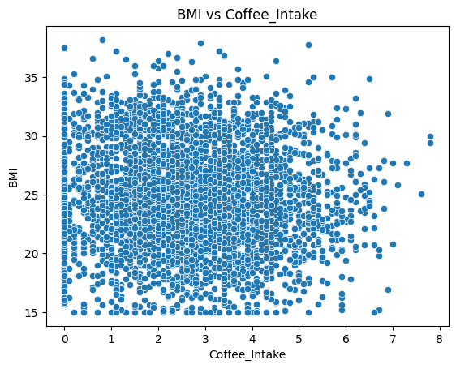
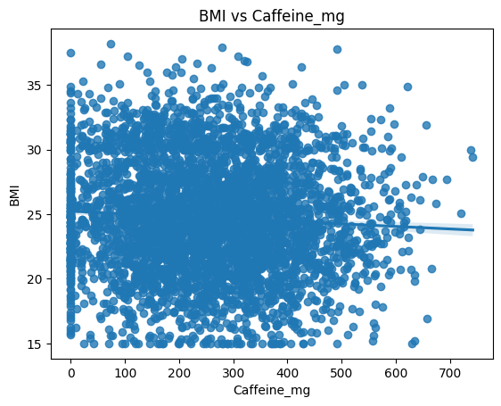
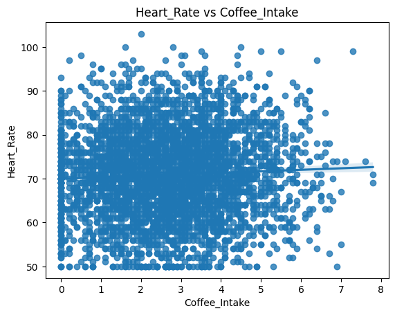
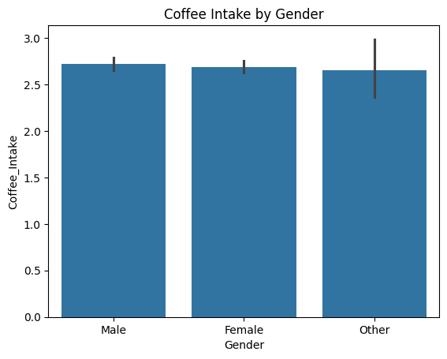

[](https://github.com/Sebine-ssm/IDS702_Week2_assignment/actions/workflows/main.yml)

## Project Structure

- `devcontainer`: The devcontainer file (more about it in the description).
- `.gitignore`: Files and folders excluded from version control.
- `Makefile`: Common commands for setup and running analysis.
- `README`: The README file which talks about the files used,
- `analysis.ipynb`: The Jupyter Notebook created and used for this project which has the outputs of the code from the analysis.py file.
- `analysis.py`: Main analysis script for data processing and visualization.
- `image files`: The files that have images of the plots presented at the end of this README which were generated through the analysis.ipynb file.
- `requirements.txt`: Python dependencies.
- `synthetic_coffee_health.csv`: Dataset used for analysis.
- `test_analysis.py`: The file that has the test cases to test the analysis.py file's functions.

# Prerequisites:
- A GitHub account
- Access to the repository (if the repo is public or if you have appropriate permissions.)
- Github Codespace or you can even download or clone the repo to work on the project locally.

## Devcontainer 
This project uses a GitHub Codespace with a Devcontainer which provides a cloud-based development environment which is easy for anyone to code. Having a Devcontainer makes your life easier since it would create it's own environment on which you can work on the project without causing any dependency or software issues with your computer. 

## Makefile Setup

install:
	pip install --upgrade pip &&\
		pip install -r requirements.txt

format:
	black *.py

lint:
	flake8 analysis.py

clean:
	rm -rf __pycache__ .pytest_cache .coverage

all:
	install format lint 

## Requirements: 
- The code inside the requirements.txt file is:
	- pylint
	- flake8
	- pytest
	- click
	- black
	- pytest-cov
	- pandas
	- numpy
	- plotly.express
	- matplotlib
	- polars
 	- scikit-learn
	- seaborn

 # Tests

Created a Test file called 'Test_analysis.py' which has 4 tests that consists of unit tests and a system test. This project includes automated tests in `Test_analysis.py` to ensure data cleaning and analysis functions work as expected.

## Test Descriptions

- **test_clean_data**:  
  Verifies that the `clean_data()` function correctly filters invalid, missing, or out-of-range data.  
  - Checks removal of rows with missing or out-of-bound values in 'Age', 'BMI', 'Sleep_Hours', and 'Heart_Rate'.
  - Ensures median imputation for missing BMI values.

- **test_load_data**:  
  Confirms that the data loading function reads a file and returns a DataFrame with the expected columns and shape.

- **test_model_training**:
	Confirms that Linear Regression can be trained successfully on the cleaned dataset.
 	Model fits without error using variables like 'Age', 'BMI', 'Sleep_Hours', and 'Heart_Rate'.
  	Predictions are generated.
   	The number of predictions matches the number of samples.
  
-  **test_end_to_end_flow**:
 	Tests that complete data workflow from synthetic data generation, cleaning to model training and evaluation.
  		-No null values remain after cleaning.
		-BMI values stay within defined bounds.
  		-Model trains and predicts on train/spilt data.
		-Evaluation metrics (MSE, R-squared) are within ranges.

## For coverage report:

```sh
pytest --cov=analysis Test_analysis.py
```

## To run all Makefile tasks (including linting and formatting):

```sh
make all
```

Make sure you have installed all dependencies:

```sh
pip install -r requirements.txt
```

## Running Tests

To run all tests, use:

```sh
pytest test_analysis.py
```
These tests help ensure the reliability and reproducibility of your data analysis workflow.
  
## Setup Instructions
- Ensure you have the following installed:
- Python 3.x
- Pandas
- Numpy
- Scikit-learn
- Unittest (built-in)
- The test assumes the analysis.py is located in the same directory.
- Install dependencies if needed.

# IDS706_Week2_assignment
Global Coffee Health Dataset

## Project Overview
This project analyzes the relationship between Coffee Consumption, Sleeping hours, Age, and BMI with Heart rate. The goal of this project is to see if there is a positive relationship between these two variables or not. 

## Data Exploration

## About the Dataset
Dataset contains information about Age, Gender, Country, Coffee Intake (in cups), Sleep Hours, Caffeiene consumption in mg, Hours of Physical Activity, Sleep Quality, BMI, Heart Rate, Stress Level, Health Issues, Occupation, Smoking, and Alcohol Consumption varaibles. It has 4057 rows and 16 columns. The name of the file of the dataset is 'synthetic_coffee_health.csv 

There were some duplicates and null values which I cleaned. Some insights which I found:

1. More than half of the people in the dataset are above 30 years of age.

2. There are no people who fall under the following categories: 'Having a BMI of less than 25 and heart rate above 50', 'Having a BMI of greater than 25 and heart rate below 50', 'Having a BMI of greater than 40 and heart rate below 50', 'Having a BMI of less than 15 or heart rate below 50', 'Doing less than 25 hours of physical activity and less than 7 hours of sleep', and and 'Having a BMI of less than 70 or heart rate above 50'.

3. Some people of South Korea who answered in this survey (213 people) have a higher percentage of drinking coffee than the Chinese people who responded (233 of them)

4. In the 'Gender' column, there are more women than men and other categories. This could be why the mean values of BMI and alcohol consumption of women are higher than men, but not by a lot (and these numbers are similar). 

5. People who consume high levels of caffeine have higher levels of stress than other people. 

## Machine Learning
Imported scikit-learn and three modules which are LinearRegression, r2_score, train_test_spilt, and mean_squared_error. 

The variables which I used for my x-values are 'Age', 'Caffeine_mg', 'Coffee_Intake', 'BMI', and 'Sleep_Hours', with my y variable being 'Heart_Rate'.
 
Performed Multiple Linear Regression and found out some interesting insights. There is a very high mean_sq_error with a very low r2_score. This shows that the model that I have used shows a very poor correlation between these variables. The coefficients are too small. 

## Plots

Created a scatterplot, bar graph and a few regression plots to visualize the results.

From the scatterplot and regression plots, we can see that the relationship between the variables ploted in those graphs have poor correlation. Created a bar graph to just see the proportion of people (categorized by gender) to see how much coffee they consume. We can see that men drink little more than women and other. 

## Pictures of plots





From my analysis I can conclude that there is a poor correlation between the variables plotted in the graphs. 


